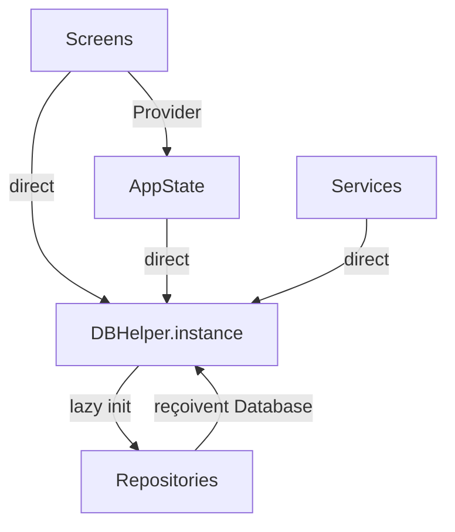
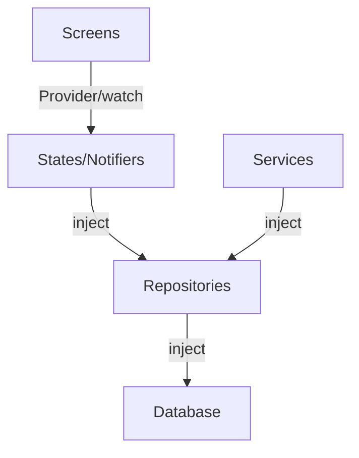

# 🔍 Audit Complet — CuniGest V2.4

> **Date** : 1er mai 2026
> **Auditeur** : CTO / Lead Developer / Product Manager
> **Scope** : 72 fichiers Dart, ~18 200 lignes de code, 36 écrans, 21 tables SQLite

---

## 📊 Tableau de Synthèse

| Catégorie | Note | Commentaire |
|---|:---:|---|
| **Vision Produit** | 🟢 A | Excellente compréhension métier, fonctionnalités très pertinentes |
| **Architecture** | 🟠 C+ | Structure correcte mais DBHelper monolithique, couplage fort |
| **Qualité du Code** | 🟢 B+ | Code lisible, bien commenté, 0 issue analyzer |
| **Sécurité** | 🟢 B+ | SQLCipher + Keystore + RLS — bien au-dessus de la moyenne |
| **UX/UI** | 🟠 B- | Material 3 + dark mode OK, mais design encore "développeur" |
| **Performance** | 🟠 C+ | Splash lent, pas de pagination, chargements non optimisés |
| **Tests** | 🔴 D | 2 fichiers de test / 72 fichiers source = couverture ~3% |
| **Maturité Store** | 🔴 D | Pas de signing release, pas de ProGuard, APK 81 MB, pas d'icône custom |
| **Sync Cloud** | 🟠 C | Fonctionnelle mais fragile (pas de gestion de pagination, pas de retry queue) |

**Note globale : C+ / B-** — Un prototype fonctionnel avancé avec un excellent cœur métier, mais pas encore une app professionnelle prête pour le Store.

---

## ✅ Ce qui fonctionne bien (les vrais points forts)

### 1. Vision produit exceptionnelle
Tu es **cuniculteur ET développeur** — c'est rare et précieux. Le résultat : chaque fonctionnalité résout un vrai problème terrain. La détection de consanguinité, le délai d'attente médicaments, le GMQ/IC sur les lots, les alertes automatiques de reproduction... ce sont des features que des concurrents SaaS n'ont souvent pas.

### 2. Architecture de données solide
- 21 tables SQLite bien structurées avec FK, index, et transactions atomiques
- Migrations v1→v9 propres et non-destructives (c'est CRITIQUE pour les mises à jour)
- `PRAGMA foreign_keys=ON` activé (beaucoup de devs l'oublient)
- Migration automatique plain→chiffré très bien pensée

### 3. Sécurité au-dessus de la moyenne
- SQLCipher AES-256 avec clé Keystore = données chiffrées même si le téléphone est rooté
- `resetOnError: true` sur `FlutterSecureStorage` = gère les bugs Xiaomi/Huawei
- RLS Supabase `auth.uid()=user_id` = isolation serveur par utilisateur
- PIN SHA-256 + sel = multi-utilisateur sécurisé

### 4. Code lisible et documenté
- Chaque fichier commence par un bloc de commentaires expliquant son rôle
- Les fonctions métier complexes sont commentées (consanguinité, streak, etc.)
- Nommage en français cohérent (pour ton contexte c'est un avantage, pas un défaut)
- 0 issue analyzer = hygiène de code respectée

### 5. Fonctionnalités pro réelles
- Export CSV RFC 4180 + BOM UTF-8 (compatibilité Excel ✅)
- Pedigree PDF 4 générations (rare dans les apps concurrentes)
- QR codes scannables pour lapins ET cages
- Étiquettes PDF A4 avec QR
- Calculatrices professionnelles (ration, prix de revient, projection GMQ)

---

## 🔴 Problèmes critiques (à corriger EN PRIORITÉ)

### P0 — Clé API Supabase en clair dans le code source

```dart
// db_helper.dart, ligne 610 et 834
'api_key': 'eyJhbGciOiJIUzI1NiIsInR5cCI6IkpXVCJ9.eyJpc3MiOiJzdXBhYmFzZS...'
```

> [!CAUTION]
> Ta clé `anon` Supabase est **hardcodée en clair** dans le code source, et elle apparaît **2 fois** (dans `_createV5Tables` et `_upgradeDB`). Si tu publies sur GitHub ou si quelqu'un décompile ton APK, il peut accéder à ton projet Supabase.
>
> **Ce n'est pas un bug théorique** — c'est le moyen #1 par lequel les projets Supabase se font compromettre.

**Correction** : Déplacer dans un fichier `.env` ou dans les variables d'environnement Flutter (`--dart-define`). Le `anon key` est public par design (grâce au RLS), mais c'est une mauvaise habitude qu'il faut casser maintenant.

---

### P0 — Fichier `db_helper.dart` : 1 799 lignes = bombe à retardement

C'est le **problème architectural #1** de l'app. Ce fichier contient :
- La connexion DB et les migrations
- TOUT le CRUD de 10+ entités (lapins, saillies, soins, stocks, ventes, tâches, alertes, profil, badges, réglages)
- La logique métier complexe (consanguinité, streak, alertes reproduction)
- Les statistiques et agrégats

> [!WARNING]
> **1 799 lignes dans un seul fichier** = impossible à maintenir, impossible à tester, impossible à travailler en équipe. Chaque ajout de feature augmente le risque de casser quelque chose d'existant.

**Correction** : Extraire en repositories dédiés (tu as déjà commencé avec `LotRepository`, `CageRepository`, etc. — il faut finir le travail) :

| Fichier actuel | Devrait être dans |
|---|---|
| CRUD lapins (~100 lignes) | `lapin_repository.dart` |
| CRUD saillies + stats repro (~200 lignes) | `saillie_repository.dart` |
| CRUD soins + délai attente (~100 lignes) | `soin_repository.dart` |
| CRUD stocks + consommation (~60 lignes) | `stock_repository.dart` |
| CRUD ventes + stats (~80 lignes) | `vente_repository.dart` |
| Tâches + complétions + gamification (~300 lignes) | `routine_repository.dart` |
| Alertes + génération auto (~120 lignes) | `alerte_repository.dart` |
| Profil + badges + streak (~200 lignes) | `profil_repository.dart` |

Le `db_helper.dart` ne devrait garder QUE : ouverture DB, migrations, et les accesseurs `Future<XxxRepository> get xxx`.

---

### P0 — Couverture de tests quasi inexistante

```
test/
├── models_test.dart    (197 lignes — 6 groupes de tests)
└── widget_test.dart    (411 octets — test par défaut Flutter, inutile)
```

> [!CAUTION]
> Tu as **~3% de couverture** sur une app avec 21 tables, de la crypto, de la sync cloud, et de la logique métier complexe (consanguinité, streak, alertes automatiques).
>
> **Conséquence concrète** : chaque fois que tu modifies une migration ou une requête SQL, tu ne sais pas si tu as cassé autre chose. Tu ne le sauras qu'en production, quand un éleveur perdra ses données.

**Ce qui devrait être testé en priorité** :
1. Migrations DB (v1→v9) — le plus critique
2. `genererAlertesReproduction()` — logique complexe, idempotence
3. `verifierConsanguinite()` — calcul récursif
4. `mettreAJourScore()` / streak — logique temporelle piégeuse
5. `SyncService._applyRowToLocal()` — intégrité des données
6. Repositories : `CageRepository.deplacerLapin()` — transactionnel

---

## 🟠 Problèmes importants (à planifier)

### I1 — Pas de gestion d'erreur globale

L'app n'a pas de `FlutterError.onError` ni de `runZonedGuarded`. Si un crash arrive en production, tu n'as aucun moyen de savoir ce qui s'est passé.

```dart
// main.dart actuel
void main() {
  WidgetsFlutterBinding.ensureInitialized();
  runApp(const CuniGestApp());  // ← crash silencieux si erreur non attrapée
}
```

**Correction** : Ajouter Crashlytics (Firebase) ou au minimum un logger local.

---

### I2 — Aucune pagination dans les requêtes

```dart
// db_helper.dart
Future<List<Lapin>> getAllLapins() async {
  final maps = await db.query('lapins', orderBy: 'date_creation DESC');
  return maps.map((m) => Lapin.fromMap(m)).toList();
  // ← Charge TOUS les lapins en mémoire d'un coup
}
```

Avec 50 lapins c'est OK. Avec 500+ (élevage pro), ça va ramer, surtout les requêtes de stats qui font des `getAllSaillies()` + `getAllLapins()` + `getAllSoins()` + `getAllVentes()` dans `verifierBadges()`.

**Correction** : Ajouter `LIMIT/OFFSET` ou le lazy loading dans les listes.

---

### I3 — `IndexedStack` charge les 5 onglets au démarrage

```dart
// main_scaffold.dart
body: IndexedStack(index: _index, children: _tabs),
```

`IndexedStack` crée et maintient en mémoire les 5 écrans simultanément (Dashboard, Cheptel, Repro, Santé, Plus). Chaque écran fait des appels DB dans son `initState`.

**Conséquence** : au démarrage, 5 écrans font chacun leurs requêtes DB → lenteur au lancement.

**Correction** : Utiliser un `IndexedStack` avec lazy loading, ou un `PageView` avec `AutomaticKeepAliveClientMixin`.

---

### I4 — Le `FormDatePicker` ne gère pas le dark mode

```dart
// common_widgets.dart, ligne 319
style: TextStyle(color: value != null ? Colors.black87 : Colors.grey),
// ← Colors.black87 en dark mode = texte invisible sur fond sombre
```

---

### I5 — Pas de signing release pour le Play Store

```kotlin
// build.gradle.kts, ligne 38
signingConfig = signingConfigs.getByName("debug")
// ← APK signé avec la clé debug = rejeté par le Play Store
```

**Correction** : Créer un keystore release (`keytool`) et configurer `signingConfig` pour le build type `release`.

---

### I6 — APK de 81 MB = trop lourd

Pour une app de gestion d'élevage qui sera utilisée en zone rurale (connexion faible), 81 MB est problématique.

**Causes probables** :
- `mobile_scanner` inclut des librairies ML pour le scan QR (~15 MB)
- Toutes les architectures ARM sont incluses (arm64 + armeabi-v7a)
- Pas de ProGuard/R8 activé pour le shrinking

**Correction** :
1. Builder un App Bundle (`.aab`) au lieu d'un APK monolithique
2. Activer `shrinkResources true` et `minifyEnabled true`
3. Utiliser `--split-per-abi` si tu restes en APK
4. Vérifier que les assets ne contiennent pas de fichiers inutiles

---

### I7 — Sync cloud : pas de gestion de conflit robuste

```dart
// sync_service.dart — stratégie : last-write-wins
```

Le `last-write-wins` est acceptable pour un utilisateur solo, mais avec le multi-utilisateur (admin + soigneur), deux personnes peuvent modifier le même lapin. Le dernier écrase le premier sans avertissement.

De plus :
- Pas de retry automatique en cas d'échec réseau (une entrée ratée reste en erreur)
- Pull limité à 500 lignes par table → peut rater des données si l'écart est grand
- Pas de sync automatique en background (uniquement manuelle)

---

### I8 — Backup : la restauration ne vérifie pas si la DB est chiffrée

```dart
// backup_service.dart, ligne 91
if (!header.startsWith('SQLite format 3')) {
  // Ce fichier n'est pas une sauvegarde valide
}
```

Le problème : depuis la V2.1, ta DB est **chiffrée** (SQLCipher). Le header d'une DB chiffrée ne commence PAS par `SQLite format 3`. Donc la restauration d'une DB chiffrée serait rejetée comme "invalide".

---

## 🟡 Améliorations recommandées (qualité pro)

### A1 — Typage des statuts avec des enums

Actuellement, les statuts sont des `String` partout :
```dart
statut: 'actif'   // ← faute de frappe = bug silencieux
statut: 'acitf'   // ← aucune erreur de compilation
```

**Correction** : Utiliser des enums Dart pour `LapinStatut`, `SaillieStatut`, `CageStatut`, `TacheStatut` etc.

---

### A2 — Internationalisation

Toute l'app est en français hardcodé. Ce n'est pas un problème aujourd'hui, mais si tu veux commercialiser dans d'autres pays francophones (Afrique de l'Ouest = gros marché cunicole), tu auras besoin de l10n.

---

### A3 — Icône d'app et splash screen natif

L'app utilise l'emoji 🐇 comme logo dans le splash screen et l'icône Android par défaut (`@mipmap/ic_launcher`). Pour le Store, il faut :
- Un logo vectoriel professionnel
- Un splash screen natif Android (`@drawable/launch_background`)
- Des icônes adaptatives (foreground + background)

---

### A4 — Utiliser `freezed` ou `equatable` pour les modèles

Tes modèles (Lapin, Saillie, etc.) ont tous des `toMap()` / `fromMap()` / `copyWith()` écrits manuellement. C'est fastidieux et source d'erreurs. `freezed` + `json_serializable` ou au minimum `equatable` réduiraient le boilerplate et ajouteraient l'equality check (utile pour Provider).

---

### A5 — Ajouter un écran "À propos" et des CGU

Pour le Store, il faut obligatoirement :
- Un écran "À propos" (version, licences open source)
- Une politique de confidentialité (surtout avec la sync cloud)
- Des conditions d'utilisation

---

### A6 — La devise `€` est hardcodée

```dart
// theme.dart
static const String devise = '€';
```

Si un éleveur au Cameroun utilise l'app, les montants affichent `€` au lieu de `FCFA`. La devise devrait être configurable dans les réglages.

---

## 📐 Analyse architecturale détaillée

### Ce qui est bien structuré

```
✅ Séparation models / repositories / services / screens / state / utils / widgets
✅ Pattern Repository pour les domaines V2+ (lots, cages, pesées, dépenses)
✅ State management avec Provider (adapté à la taille du projet)
✅ Services singleton (notification, backup, sync, encryption, CSV)
✅ Widgets réutilisables (StatCard, EmptyState, AlertBanner, FormDatePicker...)
```

### Ce qui pose problème

```
❌ DBHelper = God Object (1 799 lignes, fait tout)
❌ Couplage direct DBHelper.instance dans les écrans et les states
   → impossible de mocker pour les tests
❌ Pas d'injection de dépendance (tout est singleton statique)
❌ Les repositories V2 sont accessibles via DBHelper (await DBHelper.instance.lots)
   → devrait être dans le Provider tree
❌ Les écrans font des appels DB directs (db = DBHelper.instance)
   au lieu de passer par le state management
```

### Schéma du couplage actuel



### Schéma recommandé



---

## 🏗️ Plan de correction recommandé (par priorité)

### Phase 1 — Sécurité & Stabilité (1-2 semaines)

| # | Action | Impact |
|---|---|---|
| 1 | Externaliser la clé Supabase (`--dart-define` ou `.env`) | 🔒 Sécurité |
| 2 | Ajouter `FlutterError.onError` + `runZonedGuarded` | 🛡️ Stabilité |
| 3 | Corriger la validation de backup pour les DB chiffrées | 🐛 Bug critique |
| 4 | Corriger `FormDatePicker` dark mode (`Colors.black87`) | 🎨 Bug UI |

### Phase 2 — Tests (2-3 semaines)

| # | Action | Impact |
|---|---|---|
| 5 | Tests unitaires des repositories (migrations, CRUD) | 🧪 Confiance |
| 6 | Tests de la logique métier (consanguinité, streak, alertes) | 🧪 Confiance |
| 7 | Tests de la sync (push/pull/conflit) | 🧪 Confiance |
| 8 | Tests widget des formulaires critiques | 🧪 Confiance |

### Phase 3 — Architecture (2-3 semaines)

| # | Action | Impact |
|---|---|---|
| 9 | Extraire les CRUD de `db_helper.dart` en repositories | 🏗️ Maintenabilité |
| 10 | Injecter les repositories via Provider (pas `DBHelper.instance`) | 🏗️ Testabilité |
| 11 | Ajouter des enums pour les statuts (lapin, saillie, cage...) | 🛡️ Robustesse |

### Phase 4 — Performance & UX (1-2 semaines)

| # | Action | Impact |
|---|---|---|
| 12 | Pagination des listes (lapins, saillies, soins) | ⚡ Performance |
| 13 | Lazy loading des onglets `IndexedStack` | ⚡ Démarrage |
| 14 | Réduire la taille de l'APK (split ABI, R8, app bundle) | 📦 Distribution |

### Phase 5 — Publication Store (1-2 semaines)

| # | Action | Impact |
|---|---|---|
| 15 | Créer un logo / icône professionnels | 🎨 Image |
| 16 | Configurer le signing release | 📦 Publication |
| 17 | Ajouter écran "À propos" + politique de confidentialité | 📋 Légal |
| 18 | Devise configurable dans les réglages | 🌍 International |

---

## 💡 Verdict final

### En une phrase :
**Tu as un excellent produit métier dans une enveloppe technique qui a besoin de maturer.**

### Ce qui te différencie :
- Ta connaissance du terrain (tu ES l'utilisateur)
- La richesse fonctionnelle (consanguinité, délai médicaments, GMQ/IC, QR, etc.)
- Le chiffrement de bout en bout

### Ce qui te manque pour le Store :
- Des tests (c'est le #1 absolu)
- Un refactoring du monolithe `db_helper.dart`
- Un polish UI/UX (typography, espacement, animations)
- La configuration de build production

### Comparaison avec les concurrents :
La plupart des apps de gestion cunicole sur le Play Store sont soit des apps web déguisées (WebView), soit des apps très basiques (CRUD simple). **Ta couverture fonctionnelle est déjà supérieure** — il te manque la finition.

> [!IMPORTANT]
> **Mon conseil #1** : Ne rajoute PAS de features pour l'instant. Consolide ce que tu as. Les 18 200 lignes de code actuelles sont déjà beaucoup à maintenir. Concentre-toi sur les tests, le refactoring de `db_helper.dart`, et la préparation Store.
